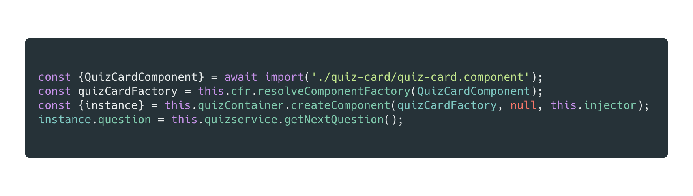
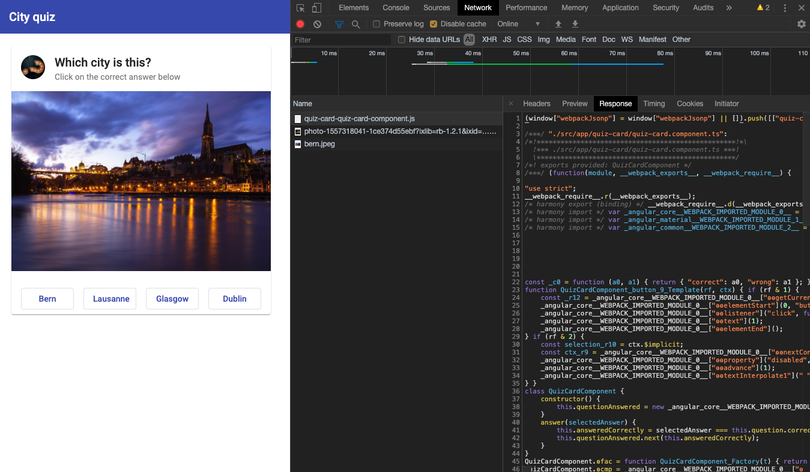

# 懒加载 Angular 组件

[原文链接](https://medium.com/angular-in-depth/lazy-load-components-in-angular-596357ab05d8)

[原作者:Kevin Kreuzer](https://medium.com/@kevinkreuzer)

[译者:尊重](https://www.zhihu.com/people/yiji-yiben-ming/posts)


在 Angular 中懒加载组件？ 在阅读完本文之前，你可能会认为 "懒加载组件" 是指通过 Angular Router 进行模块懒加载的相关技术。

但是，你没有看错，新版的 Angular 支持`懒加载组件`的能力。

虽然当前版本的 Angular 仅支持懒加载模块。但是新版本所提供的 Ivy 则为开发者提供了新的可能性。

## 迄今为止的懒加载 - 懒加载路由

懒加载是很棒的功能。在 Angular 中，开发者只需要通过声明一个 lazy route 的方式即可。


上述代码将生成一个独立的代码块，该代码块包含了 `customers.module` 模块的全部内容，当且仅当 `customer-list` 路由被触发时进行加载。

通过懒加载的方式，项目的主代码块大小将得以收缩，加快应用的初始化速度。

但设想一下，如果开发者能够对更细微粒度的内容进行懒加载控制，是不是更棒？

比如，懒加载单个组件。

截止到今天，Angular 尚不支持对单个组件的懒加载。但是，一切都因为 Ivy 发生了改变。

## Ivy 引入了 "locality"

对于 Angular 应用而言，模块是第一公民概念，也是进行业务功能隔离的主要构件块。模块中支持声明多个组件，指令，管道和服务。

今天的 Angular 应用无法脱离 module 而存在。无法脱离的理由之一是：ViewEngine 向 module 添加所有需要的 metadata。

Ivy 则采用了另一种方式。在 Ivy 环境下，component 可以脱离于 module 存在。其实现拜 `locality` 的概念所赐。

> "Locality" means that all the metadata is local to the component.

> "Locality" 意味着 metadata 是属于 component 的本地数据。

让我们通过由 Ivy 生成的 `es2015` 构建包详情来帮助理解：


在 `Component Code` 部分中，可以看到 Ivy 保留了组件的代码。除此之外还添加了一些 metadata。

第一个 metadata 是用于初始化组件的工厂函数（"Component Factory"）。在 `Component Metadata` 部分，Ivy 添加了更多的属性： `type`, `selector` - 组件在运行时需要的相关配置内容。

metadata 中有一个部分很值得深究 - Ivy 添加的 `template` 函数。

`template` 函数本质是 HTML 的编译版本。其遵循 Ivy 的指引创建 DOM。这也是其与 `ViewEngine` 工作方式不同的地方。

`ViewEngine` 获取代码并对其进行遍历，Angular 在需要使用相关代码时执行之。

通过这样的方式，组件处于驾驶员的定位支持执行 Angular。这样的改动使组件可以独立运行，并支持对 Angular Core 的摇树优化。

## 懒加载组件的真实案例

现在，我们已经知道组件级别的懒加载成为可能，我们将通过一个真实世界的用例来证明之 - 实现一个答题应用。

答题应用将会展示一个城市图片并提供不同的答案选择。一旦用户选择了一个答案，被点击的按钮将立刻展示答案是否正确，并切换为对应红色/绿色。

回答完一个问题后，下一个问题就会出现。


## 懒加载组件的概念

首先让我们介绍一下懒加载 `QuizCard` 组件的整体思路。


一旦页面的使用者点击了 `Start Quiz` 按钮开始测试，应用就会开始懒加载组件。一旦应用获取了组件的相关代码 chunk，就将其添加到容器中。

就像处理标准的组件一样，应用将对懒加载组件的 `questionAnwsered` `@Output` 事件进行响应。就表象来说，一旦 `questionAnwsere` output 事件发生，就将添加一个新的测试卡片。

## 现在让我们看看代码

为了解释懒加载组件的流程，我们先看一个 `QuizCardComponent` 组件的简化版本 - 只展示问题属性。

之后，我们将通过添加 Angular Material 组件的方式扩展我们的组件。

最后，对懒加载组件的 `@Output` 事件进行响应处理。

因此，现在我们创建一个 `QuizCardComponent` 组件的简化版本。

模板内容如下：


第一步是创建一个元素容器。为此我们只需要使用一个真实的 `div` 元素或使用一个 `ng-container`, 并不会引入任何额外级别的 HTML 内容。


在组件中，需要获得容器的引用。因此，我们需要使用 `@ViewChild` 注解，并告知其开发者想要阅读 `ViewContainerRef`。

> Note: In Angular 9 the static config in the @ViewChild annotation defaults to false.

> 注意： 在 Angular 9 中，`@ViewChild` 注解中的 `static` 属性配置默认为 `false`。


现在，我们获得了即将用于添加懒加载组件的容器。下面，我们需要通过依赖注入获取 `ComponentFactoryResolver` 和 `Injector`。

> A ComponentFactoryResolver is a simple registry that maps Components to generated ComponentFactory classes which can be used to create instances of components.

> `ComponentFactoryResolver` 是一个简单的注册表，将组件和生成的 `ComponentFactory` 类进行匹配。`ComponentFactory` 则用于创建组件实例。


完事具备，只欠东风。现在，让我们修改 `startQuiz` 方法并懒加载组件。



我们可以使用 ECMAScript 的 `import` 方法去懒加载组件 `QuizCardComponent`。 `import` 表达式将会返回一个可以通过 `async/await` 或是 `then` handler 进行处理的 promise。一旦该 promise 处于 resolve 状态，就可以对 resolve 的内容进行解构并获取组件。

为了保证可以向后兼容，我们还需要使用 `ComponentFactory` 函数。未来则可以直接对组件进行操作，因此也就不再需要该函数了。

将 `ComponentFactory` 返回的 `componentRef` 与 `Injector` 一并传递给容器的 `createComponent` 方法。

`createComponent` 函数返回了一个包含组件实例的 `ComponentRef`。我们则使用该 `instance` 将 `@Input` 属性传递给我们的组件。

> In the future, all this might be done using Angular’s renderComponent method. This method is currently still private/experimental. However, it’s very likely that this method will make it to Angular. Lars Gyrup Brink Nielsen gave a great workshop about this at InDepthConf.

> 未来，上述的所有内容都可以通过 Angular 的 `renderComponent` 方法实现。当前该方法尚处于 私有/实验性 阶段。但是在未来很有可能会公开。


一旦 `start button` 被点击，就会懒加载相关组件。如果打开控制台的 network tab 页面，会看到 `quiz-card-quiz-card-component.js` 代码块被懒加载。而在运行的应用中，懒加载的组件将会展示出内容：问题被正常地展示出来。

## 添加 Material

现在，懒加载组件 `QuizCardComponent` 已经完成。虽然很酷，但是我们的应用尚不可用。

我们需要给组件加入一些新功能和 Angular material 组件。


虽然加入了一些 Material 组件，但是有一个核心问题：应该在何处添加 Material Module。

当然，我们可以将其添加在 `AppModule` 中。但是这意味着这些 module 是需要主动加载的；这不是最佳的解决方案。更有甚者，构建过程将会失败并提示如下信息：

```bash
ERROR in src/app/quiz-card/quiz-card.component.html:9:1 - error TS-998001: 'mat-card' is not a known element:
1. If 'mat-card' is an Angular component, then verify that it is part of this module.
2. If 'mat-card' is a Web Component then add 'CUSTOM_ELEMENTS_SCHEMA' to the '@NgModule.schemas' of this component to suppress this message.
```

我们应该怎么处理呢？或许我们还需要从懒加载组件上做文章。

在懒加载组件 `QuizCardComponent` 中添加 Angular Material component 所需的 module。


加入的模块仅属于懒加载组件。因此，相应模块的唯一声明组件是 `QuizCardComponent`。在 `imports` 部分中，只添加组件所需的模块。

为了确保主动加载的模块不会导入该 module，组件不会导出相关的 module。

现在让我们看看实际效果，点击一下 `Start Quiz` 按钮。



如上图所示，`QuizCardComponent` 组件通过懒加载加入到 `ViewContainer` 中，并包含了所有需要的依赖。

现在，让我们使用名为 `webpack-bundle-analyzer` 的工具分析应用的构建方式。


应用的 main bundle 约为 `260kb`。如果我们主动载入 `QuizCartComponent`, main bundle 则约为 `270kb`。通过懒加载组件的方式，我们给 main bundle 节省了 `10kb` 的内容。

`QuizCartComponent` 组件则被打包为独立的代码 chunk。chunk 中不仅仅包含 `QuizCartComponent` 的相关代码，还包含 `Material module` 的相关内容。

> Even though the QuizCardComponent used MatButtonModule and MatCardModule only the MatCardModule ends up in the quiz-card component chunk. Reason for that is because we also use the MatButtonModule in our AppModule to display the start quiz button. Therefore it ends up in another chunk.

> 虽然 `QuizCardComponent` 使用了 `MatButtonModule` 和 `MatCardModule`, 但是只有 `MatCardModule` 被封在 `QuizCardComponent` 的代码块中。这是因为我们还在 `AppModule` 中使用 `MatButtonModule` 展示了 `Start Quiz` 按钮。因此 `MatButtonModule` 被打包在其他 chunk 中。

此时，懒加载的组件能够通过 Material 卡片展示城市图片和可选的答案。但是如果我们此时点击选择项会怎么样呢？

基于你的选择，按钮将会切换为红色或绿色。但是除此之外呢？我们还有一些功能没有实现。

## 响应懒加载组件的事件

之所以回答正确后也不会展示下一题的原因是，我们尚未对懒加载组件的 `@Output` 事件进行响应。`QuizCardComponent` 的事件将通过 `EventEmitter` 抛出。`EventEmitter` 其实继承自 `Subject` 类。

```typescript
export declare class EventEmitter<T extends any> extends Subject<T>
```

这也就意味着，`EventEmitter` 同样包含一个 `subscibe` 方法，调用该方法将对抛出的事件进行响应。


通过对 `questionAnswered` stream 的订阅，并调用 `showNextQuestion` 方法，就可以实现 `lazyLoadQuizCard` 逻辑。

> `takeUntil(instance.destroy$)` is necessary to clean up the subscription once the component gets destroyed. If the `QuizCardComponent`‘s `ngOnDestroy` lifecycle hook gets called the `destroy$` Subject is called with `next` and `complete`

> 在组件销毁时对订阅进行清理时，就需要使用 `takeUntil(instance.destroy$)`。当 `QuizCardComponent` 的 `ngOnDestroy` 生命周期钩子被调用时，`destroy$` Subject 将会调用 `next` 和 `complete` 方法。

```typescript
async showNewQuestion() {
  this.lazyLoadQuizCard();
}
```

因为 `QuizCard` 已经被加载，因此不再需要额外的 HTTP 请求。我们只需要使用之前引入的 chunk 代码，创建新的组件并将其添加到容器中即可。

## 生命周期钩子

懒加载 `QuizCardComponent` 的过程中，几乎每一个生命周期钩子都会被自动调用。但是其实，有一个钩子是不会被调用的。


如上所示，不会被自动调用的钩子是 `ngOnChanges`。因为我们手动更新了组件实例的 input 属性，因此需要由开发者负责调用 `ngOnChanges` 钩子。

为了于实例之上调用 `ngOnChanges` 钩子，我们需要手动构建 `SimpleChanges` 对象。


在组件实例上调用 `ngOnChanges` 方法并将 `SimpleChange` 对象传递给方法。 `SimpleChange` 指出其为第一次 change，其 previous value 是 `null` 而 current value 则为问题。

太棒了，我们通过第三方 module 懒加载了组件，响应了 output 事件，并正确地调用了生命周期钩子函数。

## 源码

本文中的所有内容的源代码都可以放在这个[repo](https://github.com/kreuzerk/city-quiz)中。

## 总结

组件级别的懒加载向我们的应用提供了更多性能优化方面的可能性。相比于通过 Angular router 对功能进行模块级别的懒加载，开发者拥有了更细粒度的懒加载控制能力。

不幸的是，在组件中使用其他 modules 还是需要 module 的能力。但是这一规则很有可能在未来发生改变。

Ivy 使用 `Locality` 使组件可以独立存在。这一概念是 Angular 未来改变的立命之本。